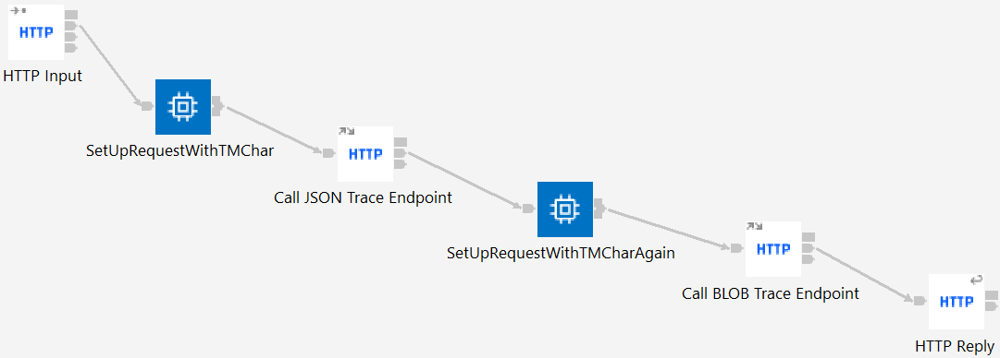

# TMCharacter

This application creates either XML or JSON strings containing the Unicode TM character (U+2122) 
as an example of how to create ACE message trees with Unicode data. The flows use ESQL to create
the tree, and then the HTTP Reply node serialises the data back to the waiting client. Tests also
verify the correctness of the flows without needing manual verification.

### How to get started with TMCharacter

To try this demo out using the ACE toolkit:

1) Clone this repo using the ACE v12 toolkit Git perspective, making sure to select the "Import all existing Eclipse projects after clone finishes" checkbox on the "Clone Git Repository" dialog page.
2) From the Integration perspective, right-click on "TMApplication_Test" and select "Run Test Project"; this should successfully run the JUnit tests.
3) Optionally, inspect the test source and expected messages.

The demo can also be run (on Linux) from the command line using the build-and-ut.sh on Linux.

The tests should run successfully, showing that the XML and JSON streams are created correctly. For browser-based
verification, the application can be deployed to a server (independent or node-associated) and then the browser
pointed at http://localhost:7800/tmXMLfromESQL or http://localhost:7800/tmJSONfromESQL (adjust host and port as
needed) to show the Unicode results that way. This is often the best way to validate Unicode-related solutions due
to modern browsers rendering Unicode correctly; command-line shells do not always handle Unicode correctly.

## Client for TraceInput

This application also contains a client that can call the TraceInput flow to show Unicode data being sent
as a request. The TraceInput flow will print out JSON and BLOB forms of the data.

