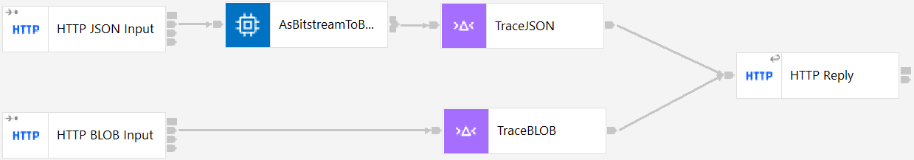

# TraceInput

This application prints out the input message to the server console as a BLOB and (optionally)
as JSON, showing the data received on the wire. This can be used to verify JSON data being 
received correctly, though care must be taken when interpreting the console output as the exact
JSON strings printed out will depend on the console codepage; the BLOB hex data is unaffected
by the codepage and should always reflect the data on the wire.

### How to get started with TraceInput

To try this demo out using an ACE server:

1) Clone this repo using the ACE v12 toolkit Git perspective, making sure to select the "Import all existing Eclipse projects after clone finishes" checkbox on the "Clone Git Repository" dialog page.
2) 
3) 

