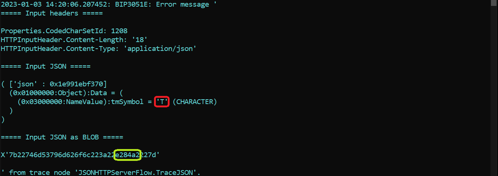

# TraceInput

This application prints out the input message to the server console as a BLOB and (optionally)
as JSON, showing the data received on the wire. This can be used to verify JSON data being 
received correctly, though care must be taken when interpreting the console output as the exact
JSON strings printed out will depend on the console codepage; the BLOB hex data is unaffected
by the codepage and should always reflect the data on the wire.


### How to get started with TraceInput

To try this demo out using an ACE server:

1) Clone this repo using the ACE v12 toolkit Git perspective, making sure to select the "Import all existing Eclipse projects after clone finishes" checkbox on the "Clone Git Repository" dialog page.
2) Deploy the TraceInput application to an ACE server using mqsibar, the toolkit, or ibmint.
3) Send JSON data to `http://localhost:7800/jsonHTTPTraceAsJSON` to see it printed out as JSON and BLOB to the server console.
4) Send any data to `http://localhost:7800/jsonHTTPTraceAsBLOB` to see it printed out as hex BLOB data to the server console.

## Sending Unicode data to the flow using a file

After the flow is proven to be working as expected in step 3, an existing Unicode file can be
sent to the trace flow to show Unicode data being processed correctly. Running
```
curl -X POST -H "Content-Type: application/json" --data-binary @tmSymbol-JSON.txt http://localhost:7800/jsonHTTPTraceAsJSON
```
should show the data correctly sent as Unicode, with the expected `e284a2` sequence (the UTF-8
codes for the TM symbol) shown in the BLOB output. The JSON output may not show the correct symbol
if the console shell is not set to handle Unicode, however: many English-language Windows shells
are set to codepage 437 (use the `chcp` command to check), which leads to the letter "T" being 
used instead:



Note the printed "T" circled in red, with the expected hex sequence in green. The flow data is 
correct in the server message tree, and is being correctly processed, but is not displayed 
correctly by the trace node due to the console not being in a Unicode-capable codepage. This 
can cause confusion when debugging codepage issues, and the binary BLOB data is the surest 
way to see what is really stored in the message tree.

Note also the content length is 18, but `{"tmSymbol":"™"}` has only 16 characters; this is 
because the UTF-8 encoding of the TM character takes three bytes but only represents one character.

## Sending Unicode data to the flow without using a file

While it fairly simple to send ASCII data to the trace flow with commands such as
```
curl -X POST -H "Content-Type: application/json" --data-ascii '{"abc":"def"}' http://localhost:7800/jsonHTTPTraceAsJSON
```
or on Windows
```
curl -X POST -H "Content-Type: application/json" --data-ascii "{""abc"":""def""}" http://localhost:7800/jsonHTTPTraceAsJSON
```
sending Unicode data is more complicated in many cases. Replacing the ASCII data with Unicode
characters may look right on the screen, but actually be converted to ISO-8859-1 before being
sent, depending on the operating system and shell.

For example, trying to send the Unicode TM symbol from curl 7.83.1 on Windows like this:


actually gets sent as character value 99 on the wire due to codepage issues on the client side:


and in fact when the server flow returns the data sent to it, the curl command outputs
a replacement character (circled in red in the curl command picture). Using the curl
`--data-binary` option results in the same issue.

Using a file to contain Unicode characters to be sent is the safest way to test Unicode
handling; these files can be edited using many editors, including vscode. ACE flows can
also safely generate Unicode data: see the [TMCharacter README](/TMCharacter/README.md)
for a client flow that can be triggered by curl and calls TraceInput with Unicode data.

## Other codepages

JSON data is normally Unicode, but ACE will handle other codepages if asked to do so. For
example, sending mainframe EBCDIC JSON to the flow using a file in this repo
```
curl -X POST -H "Content-Type: application/json; charset=ibm-1047" --data-binary @ebcdic-JSON.txt http://localhost:7800/jsonHTTPTraceAsJSON
```
will be parsed correctly and the JSON data printed out in the console codepage:
```
2023-01-03 14:38:53.533060: BIP3051E: Error message '
===== Input headers =====

Properties.CodedCharSetId: 1047
HTTPInputHeader.Content-Length: '18'
HTTPInputHeader.Content-Type: 'application/json; charset=ibm-1047'

===== Input JSON =====

( ['json' : 0x1e991ebf370]
  (0x01000000:Object):Data = (
    (0x03000000:NameValue):ebcdic = 'true' (CHARACTER)
  )
)

===== Input JSON as BLOB =====

X'c07f8582838489837f7a7fa399a4857fd025'

' from trace node 'JSONHTTPServerFlow.TraceJSON'.
```
with the BLOB hex showing the non-ASCII values sent on the wire.

This is a highly unusual scenario, but other (simpler) codepages such as latin-1 can
also be used as long as the client sends the correct "charset=" value in the Content-Type header.
